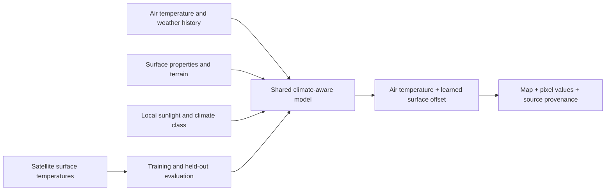

# Surface Observatory

An experimental land surface temperature (LST) map, with a React interface and
a Python geospatial pipeline. Explore the deployed application at
**[degenerate.energy](https://degenerate.energy)**.

The map estimates surface temperature from air temperature, weather, satellite
surface reflectance, terrain and climate context. Surface temperature is not
the same quantity as the temperature reported by a weather station.

**Release status — 26 September 2026:** the current application is retained as
an experimental release. The live global model is frozen; subsequent research
models have not replaced it. The goal of mean absolute error ≤3°C across
regions and day/night conditions has **not** been demonstrated. See
[Research status](docs/RESEARCH_STATUS.md) for the completed comparisons and
remaining limitations.

## What the application does

- Draw a land area beyond the original twelve pilots, choose a local date and
  time, and request day or night predictions.
- Export **100, 250, 500 or 1,000 m** GeoTIFFs, a map overlay, coverage/quality
  rasters and source provenance; inspect numerical values on the map.
- Use a separate original pilot mode for archived satellite comparisons and
  daylight air-temperature scenarios.
- View checked research comparisons and download aggregate metrics in
  **Model & evidence**.

Dates begin on 1 February 2021. The latest accepted hour depends on the service
configuration and is advertised by
[`/api/global/capabilities`](https://degenerate.energy/api/global/capabilities).
An accepted date does not guarantee complete inputs at every location. Missing
inputs remain unavailable. Polar caps and dateline-crossing windows are not
currently supported.

## How it works



The live global model predicts **air temperature + a learned surface offset**.
Its 40 ordered inputs include optical indices and an albedo proxy, terrain,
solar geometry, weather history and climate class. The adapter checks the
model's SHA-256, runtime version, input order, finite values and known climate
classes before prediction. There is no validated global uncertainty interval.

Source preparation uses canonical 512 × 512 grids of 100 m cells so changing a
drawn area does not change the underlying source predictions. Coarser exports
average those predictions and require at least 80% valid area. A 100 m output
grid does not establish 100 m observational accuracy. Export cell footprints
can differ when requests select different projected coordinate systems.

| Directory | Responsibility |
|---|---|
| [`src/lst_global`](src/lst_global) | Frozen inference, global grids, source preparation, bounded jobs and raster API |
| [`src/lst_pilot`](src/lst_pilot) | Shared data adapters, pilot experiments and the original pilot API |
| [`web`](web) | React/TypeScript, Vite and MapLibre interface; public aggregate evidence |
| [`tests`](tests) | Python checks for scientific and service contracts |
| [`deploy`](deploy) | Caddy and systemd deployment templates |
| [`reports`](reports) | Selected training/evaluation source and original protocols |

Historical weather uses ERA5/ERA5T. The most recent dates can use an explicitly
experimental GFS/station-report path; that change of weather source has not
been accuracy-validated. Research comparisons using ERA5-Land air temperature
are separate from the live station/weather adapter.

## Development setup

Use Python **3.11 or newer**, Node.js **22** and npm. On Linux, geospatial wheels
provide the usual GDAL/PROJ dependencies; platforms without suitable wheels
need compatible system libraries. From the repository root:

```sh
python3 -m venv .venv
. .venv/bin/activate
python -m pip install -e '.[web]'

cd web
npm ci
npm run build
```

The frontend output is `web/dist`. `npm run dev` starts Vite for UI work;
requests to `/api` still require the Python services through a same-origin
proxy. Building the UI does not download source imagery or train a model.

The frozen global model specifically requires **scikit-learn 1.9.0**, checked
by the adapter even though the package's general dependency range is broader:

```sh
python -m pip install 'scikit-learn==1.9.0'
```

[`requirements-tested.txt`](requirements-tested.txt) records the packages in the
Linux/Python 3.13 environment used for the release checks. It is an environment
snapshot, not a portable lockfile for every operating system.

Python checks use `python -m pytest tests`; frontend checks use
`node --test tests/*.test.mjs` from `web`. Checks requiring separately held
model/source artifacts cannot establish full reproducibility from code alone.
The release check passed **842 Python tests**, **32 frontend tests** and the
production frontend build on the server. The local day/night calculation also
agreed with pvlib at six test sites to within 0.006° solar elevation.

## Models and source data

This source checkout includes the application, adapters, tests and compact
public evidence. It does **not** include the full source caches, training
arrays, job databases or fitted model artifacts needed to reproduce the
deployed service. There is no automatic model download on startup.

The live global F artifact is 148,557 bytes, with SHA-256:

```text
c955f3a69e393eef29dd95e291d751b73e845a43e7ab2067289c6f1cc394f447
```

[`src/lst_global/model.py`](src/lst_global/model.py) declares the exact artifact
path and 40-feature contract. Only those verified bytes are accepted. The
original pilot API uses a different saved model and catalog. The optional
compiled F backend also requires its separately verified shared library;
`LST_F_INFERENCE_BACKEND=sklearn` uses the Python implementation.

Data adapters use sources including Landsat surface reflectance, NASA thermal
products, ERA5/ERA5-Land, terrain, land cover and station observations. Some
research workflows require the operator's own NASA Earthdata, AppEEARS or
Copernicus access and dataset permissions. Keep credentials outside the
repository and public web root. Source datasets and third-party assets retain
their own licences and attribution requirements.

## Server deployment

The reference deployment runs on one existing Hetzner VM: Caddy serves static
files and routes the original pilot API to port **8000** and the isolated
global API to port **8001**. There is no production Node server. After model,
catalog and writable cache/job directories have been provisioned, the API
entry points are:

```sh
python -m uvicorn lst_pilot.api:app --host 127.0.0.1 --port 8000 --workers 1
python -m uvicorn lst_global.api:app --host 127.0.0.1 --port 8001 --workers 1
```

Adapt the templates in `deploy` to your domain, service account and storage
paths. Their default project root is `/opt/lst-pilot`; the global model path is
separately pinned in its adapter. Run one process per API/job ledger, with an
unprivileged account and a reverse proxy. The maintained global unit caps the
service at four CPU cores' worth of time and 8 GiB RAM; individual raster jobs
have a 30-minute deadline. Recent operational weather is enabled only with
`LST_ENABLE_OPERATIONAL_WEATHER=1`.

Current global admission limits are:

| Output cell size | Maximum requested area |
|---|---:|
| 100 m | 6,400 km² |
| 250 m | 14,400 km² |
| 500 or 1,000 m | 25,600 km² |

The service also limits output to 800,000 cells, 16 source tiles per request,
three pending jobs, six new jobs per connection/hour, 48 new jobs/day and 64
source tiles/day. Downloads are retained for 30 days. The capability response
is authoritative; limits and source availability can change. This is bounded
on-demand generation, not a completed worldwide hourly raster service.

## Licence

Project code is released under [Apache License 2.0](LICENSE). See
[third-party notices](THIRD_PARTY_NOTICES.md) for data, map and dependency
attribution and the included boundary-data exception.
